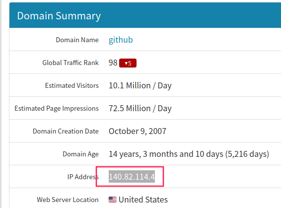

# Git 总结

## 内网无法访问`Github`的问题 

### Github能ping但打不开（即使使用VPN）

打开`C:\Windows\System32\drivers\etc\hosts`，注释掉带有`github.com`的行

```markdow
#140.82.114.4 github.com
#140.82.113.3 github.com
199.232.69.194 github.global.ssl.fastly.net
```

对于linux，打开hosts，

```shell
sudo gedit /etc/hosts
```

再将以下内容添加到最后

```shell
140.82.113.3 github.com
185.199.108.154 github.githubassets.com
185.199.109.154 github.githubassets.com
185.199.110.154 github.githubassets.com
185.199.111.154 github.githubassets.com
185.199.108.154 github.githubassets.com
185.199.109.154 github.githubassets.com
185.199.110.154 github.githubassets.com
185.199.111.154 github.githubassets.com
199.232.68.133 camo.githubusercontent.com
199.232.68.133 camo.githubusercontent.com
199.232.68.133 github.map.fastly.net
199.232.68.133 github.map.fastly.net
199.232.69.194 github.global.ssl.fastly.net
199.232.69.194 github.global.ssl.fastly.net
140.82.113.5 api.github.com
140.82.113.5 api.github.com
199.232.68.133 raw.githubusercontent.com
199.232.68.133 raw.githubusercontent.com
199.232.68.133 user-images.githubusercontent.com
199.232.68.133 user-images.githubusercontent.com
199.232.68.133 favicons.githubusercontent.com
199.232.68.133 favicons.githubusercontent.com
151.101.113.194 github.global.ssl.fastly.net
192.30.253.112 github.com
```

如果能ping但是在浏览器里打不开github，还是把刚才添加的内容删掉吧，然后关掉无线网重启后，再登录github，秒开。

[完美解决github访问速度慢]: https://zhuanlan.zhihu.com/p/93436925
[解决Linux访问Github速度慢的问题]: https://blog.csdn.net/qq_17403617/article/details/118584780

### Github访问慢

访问[该网站](https://github.com.ipaddress.com/)获得一个访问Github最快的IP地址，在浏览器直接输入该IP地址访问。



将该IP地址写入hosts文件中，然后在cmd下运行命令 `ipconfig /flushdns`刷新DNS缓存。

或者关闭无线网重连。

### git push 失败

类似如下错误

```shell
remote: Support for password authentication was removed on August 13, 2021. Please use a personal access token instead.
remote: Please see https://github.blog/2020-12-15-token-authentication-requirements-for-git-operations/ for more information.
fatal: Authentication failed for 'https://github.com/jinbooooom/git.git/'
```

可以先创建`token`,参考[关于2021年8月13日github不再支持密码身份验证的解决方案](https://blog.csdn.net/qq_42714262/article/details/119706383)，然后使用命令，设置repo。

```shell
git remote set-url origin https://your_token@github.com/your_account/your_repo_name.git
# such as
git remote set-url origin https://your_token@github.com/jinbooooom/git.git
```

## 提交规范

> **commit message 格式**
>
> ```html
> <type>(<scope>): <subject>
> // 空一行
> <body>
> ```

### `type`(必须)

参考[此文](http://www.ruanyifeng.com/blog/2016/01/commit_message_change_log.html)的提交规范，根据个人的需要，整理一套适合自己笔记总结类型的仓库的 commit 规范。

type 用于说明提交的类型，只允许使用下面的标识：

*文档：*

note 与 doc：note指记录对某一知识总结的笔记文档，而doc指某一个文件的说明、介绍或者工具的使用等非笔记总结的文档。

- note/doc init：创建新文档
- note/doc feat：文档增加新内容
- note/doc style：修改文档格式、错别字等不影响内容的提交
- note/doc refactor：文档内容的重新整理，涉及到大面积的修改，但不影响文档的主题
- sources：添加资源，如pdf文档，书中代码实例的压缩包等

*代码：*

- feat：新功能（feature）
- fix/to：修复bug，可以是QA发现的BUG，也可以是研发自己发现的BUG。
  - fix：产生diff并自动修复此问题。适合于一次提交直接修复问题
  - to：只产生diff不自动修复此问题。适合于多次提交。最终修复问题提交时使用fix
- style：格式（不影响代码运行的变动）。
- refactor：重构（即不是新增功能，也不是修改bug的代码变动）。
- perf：优化相关，比如提升性能、体验。
- test：增加测试。
- chore：构建过程或辅助工具的变动。
- analysis：分析源码时，一些必要的注释。

*通用：*

- revert：回滚到上一个版本。
- merge：代码合并。
- sync：同步主线或分支的Bug。

*临时保存：*

- tmp

### `scope`

`scope`用于说明 commit 影响的范围，比如数据层、控制层、视图层等等，视项目不同而不同。

### **`subject`**

`subject`是 commit 目的的简短描述，不超过50个字符。

### `Body`

`Body` 部分是对本次 commit 的详细描述，可以分成多行。
